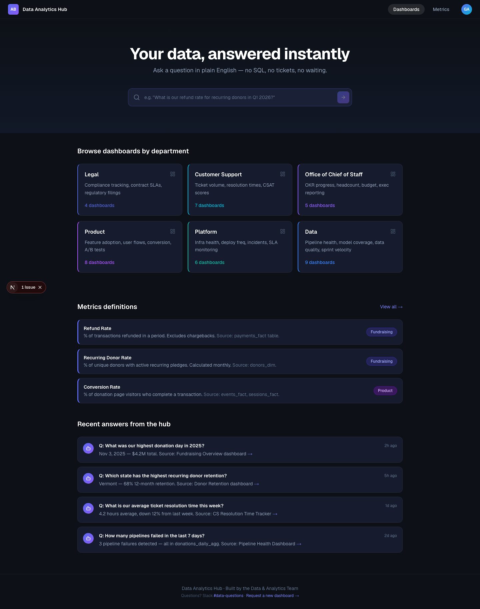
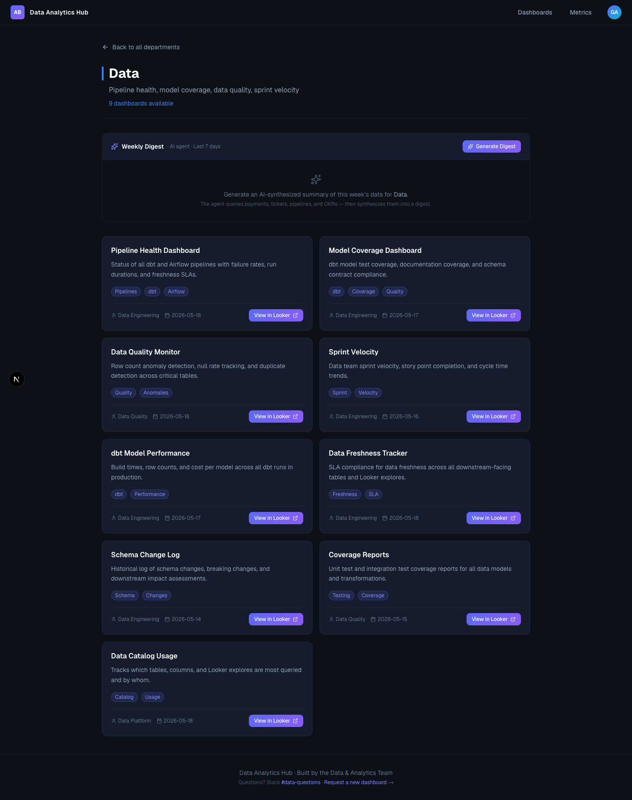

# Data Analytics Hub

> **Built in under 1 hour** using Claude Code and modern AI tooling — full-stack app, working AI search pipeline, Claude agent with tool use, SQLite database with realistic dummy data, 59 passing tests, and a production roadmap. See [Roadmap](#roadmap) for how this scales to production.

---

A centralized internal portal where employees across every department can browse their existing dashboards, discover data, and get answers to data questions in plain English — no SQL, no tickets, no waiting.

An internal portal like this shifts the Data team from a reactive, service-based model to a proactive, product-based one. It builds brand value for the Data team, reduces the cost of data access for the whole organization, and creates a natural on-ramp for AI adoption across every function.

Built with Next.js, Claude AI (Text-to-SQL + Agents), and SQLite.

---

## About This Project

My production work lives behind GDPR, HIPAA, and internal data compliance agreements — real schemas, real donor and patient data, real pipelines — none of which can be shared in a public repository.

This project exists to show what I can design, architect, and ship quickly using modern AI tooling, and how I think about taking a prototype to a production-grade internal product. The [Roadmap](#roadmap) section reflects real decisions I would make on the path from demo to enterprise deployment.

   

---

## Screenshots

**Home — AI search, department browser, metrics, recent answers**


**Department drill-down — Weekly Digest agent + Looker dashboard list**


---

## Features

- **AI Search** — Ask questions in plain English. Claude generates SQL, runs it against the database, and returns a natural language answer.
- **Weekly Digest Agent** — On any department page, trigger a Claude agent that autonomously calls multiple data tools, reasons across the results, and streams a synthesized weekly summary live to the UI.
- **Department Dashboards** — Browse Looker dashboards organized by department: Legal, Customer Support, Office of Chief of Staff, Product, Platform, and Data.
- **Metrics Definitions** — A single source of truth for how key metrics are defined and where they come from.
- **Recent Answers Feed** — See what others have asked and discovered.
- **SQL Injection Guard** — Only `SELECT` queries are ever executed against the database.

---

## Tech Stack

| Layer | Technology |
|---|---|
| Framework | Next.js 16 (App Router) |
| Language | TypeScript |
| Styling | Tailwind CSS v4 |
| AI | Anthropic Claude (`claude-haiku-4-5`) |
| Database | SQLite via `better-sqlite3` |
| Testing | Jest + React Testing Library |

---

## Prerequisites

- Node.js 18+
- An Anthropic API key — get one at [console.anthropic.com](https://console.anthropic.com)

---

## Getting Started

### 1. Clone the repo

```bash
git clone git@github.com:gavadha/data-analytics-hub.git
cd data-analytics-hub
```

### 2. Install dependencies

```bash
npm install
```

### 3. Add your API key

Create a `.env.local` file in the project root:

```bash
cp .env.example .env.local
```

Then open `.env.local` and replace the placeholder with your real key:

```
ANTHROPIC_API_KEY=sk-ant-api03-...
```

> Never commit `.env.local` — it is already in `.gitignore`.

### 4. Seed the database

This creates `data/analytics.db` with realistic dummy data (1,200 donors, 4,800 payments, 850 support tickets, 546 pipeline runs, 18 OKRs):

```bash
npm run db:seed
```

### 5. Start the dev server

```bash
npm run dev
```

Open [http://localhost:3000](http://localhost:3000) in your browser.

---

## Project Structure

```
src/
├── app/
│   ├── page.tsx                      # Home page (hero, departments, metrics, recent answers)
│   ├── department/[slug]/            # Department drill-down with digest agent + dashboard list
│   ├── metrics/                      # Full metrics definitions page
│   └── api/
│       ├── genie/route.ts            # AI search — Claude Text-to-SQL pipeline
│       └── agent/digest/route.ts     # Weekly Digest agent — agentic loop + SSE streaming
├── components/
│   ├── Navbar.tsx
│   ├── HeroSearch.tsx                # AI search bar with answer display
│   ├── DepartmentCard.tsx
│   ├── WeeklyDigest.tsx              # Agent UI — streaming digest with live typing effect
│   ├── MetricsSection.tsx
│   ├── RecentAnswers.tsx
│   └── Footer.tsx
├── lib/
│   ├── db.ts                         # SQLite connection + schema definition
│   ├── agentTools.ts                 # Agent tool functions + AGENT_TOOLS definitions
│   ├── mockData.ts                   # Static mock data (departments, metrics, recent answers)
│   └── sqlGuard.ts                   # SELECT-only query safety check
└── __tests__/
    ├── api/genie.test.ts             # Genie route tests (input validation, SQL guard)
    ├── api/digest.test.ts            # Digest agent route tests (streaming, SSE format)
    ├── lib/agentTools.test.ts        # Tool function unit tests
    ├── components/DepartmentCard.test.tsx
    └── components/MetricsSection.test.tsx
scripts/
└── seed.ts                           # Seeds SQLite with 7,400+ rows of realistic dummy data
data/
└── analytics.db                      # SQLite database (generated by db:seed, gitignored)
```

---

## Available Scripts

| Command | Description |
|---|---|
| `npm run dev` | Start development server at localhost:3000 |
| `npm run build` | Build for production |
| `npm run start` | Start production server |
| `npm run db:seed` | Seed the SQLite database with dummy data |
| `npm run test` | Run all 59 tests |
| `npm run test:watch` | Run tests in watch mode |
| `npm run test:coverage` | Run tests with coverage report |

---

## How the AI Search Works

1. User types a question in plain English
2. The question is sent to `POST /api/genie`
3. Claude receives the full database schema as a cached system prompt and generates a SQL `SELECT` query
4. The query is validated (only `SELECT` allowed) and run against SQLite
5. The raw results are sent back to Claude to format as a clear, concise natural language answer
6. The answer, source, confidence level, and generated SQL are returned to the UI

**Example questions to try:**
- *"Which state has the highest recurring donor retention?"*
- *"What is our refund rate?"*
- *"How many support tickets were escalated this week?"*
- *"Which pipelines failed in the last 7 days?"*
- *"What is the average gift size?"*
- *"How many OKRs are at risk this quarter?"*

---

## How the Weekly Digest Agent Works

The Weekly Digest is a Claude agent with tool use — not a single prompt, but an autonomous loop that decides what data to collect, collects it, and synthesizes it.

**Agentic loop:**

```
User clicks "Generate Digest" on a department page
  → POST /api/agent/digest { department, slug }
  → Claude receives 4 tool definitions and the task
  → Claude decides which tools to call and calls them:
      query_payments_summary(days=7)    → total donations, refund rate, avg gift
      query_tickets_summary(days=7)     → volume, CSAT, resolution time, escalations
      query_pipelines_summary(days=7)   → success rate, failed pipeline names
      query_okrs_by_department("Data")  → on-track / at-risk / off-track counts
  → Tool results are returned to Claude
  → Claude synthesizes across all results into a structured digest
  → Response streams back to the UI word-by-word via Server-Sent Events
```

**Why this is an agent and not just a prompt:**
Claude autonomously decides which tools are relevant for the department, calls them in parallel or sequence, and reasons across the combined results. It is not told what data to fetch — it decides. The agentic loop continues until Claude stops requesting tools (`stop_reason: end_turn`).

**Digest format:**
```
Headline: One sentence — the most important thing this week.

Key Numbers
· Pipeline success rate: 99.2% (6 runs, 0 failures)
· OKRs on track: 3 of 4

⚠️ Watch Out
· donations_daily_agg failed 3 times — downstream dashboards may be stale

✓ Looking Good
· All critical pipelines recovered within 2 hours
· Data quality OKR at 92% progress
```

---

## Roadmap

This repository is a working prototype. The sections below describe the intended path from demo to production-grade internal tool.

### 1. Replace Claude Text-to-SQL with Databricks Genie

The current AI search uses Claude to generate SQL against a local SQLite database. In production, this layer should be replaced with **Databricks Genie**, which connects directly to your existing data warehouse and understands your actual schemas, table names, and business logic out of the box.

- Wire `POST /api/genie` to the [Databricks Genie API](https://docs.databricks.com/en/genie/index.html)
- Genie handles query generation, execution, and result formatting natively
- The UI and route contract stay the same — only the backend implementation changes
- Fallback to the Claude Text-to-SQL layer can be kept for tables not yet in Databricks

### 2. Real Looker Dashboard Sync

Dashboard cards currently show mock URLs. In production, the dashboard list should be populated automatically from Looker so that new dashboards appear in the portal the moment they are published — with no manual updates required.

- Use the [Looker API](https://developers.looker.com/api/explorer) (`/lookml_models`, `/dashboards`) to fetch all published dashboards and their metadata
- Run a sync job (cron or webhook) that writes dashboard records to the production database whenever a Looker dashboard is created, updated, or archived
- Store `looker_id`, `title`, `description`, `folder`, `owner`, and `last_updated` per dashboard
- Map Looker folders or tags to hub departments automatically

### 3. Authentication and Authorization with Okta

The portal should only be accessible to authenticated employees, with access to certain dashboards restricted by department or role.

- Integrate **Okta OIDC** using [NextAuth.js](https://next-auth.js.org/) with the Okta provider
- Protect all routes with a session middleware check
- Map Okta groups to hub departments — a Legal employee sees Legal dashboards but cannot browse Platform internals
- Pass the authenticated user's identity to the Genie API so query audit logs are tied to real users
- Display the user's real name and avatar in the navbar instead of the hardcoded initials

### 4. Production Database

SQLite is used for local development and demos only. It does not support concurrent writes and cannot persist across serverless function invocations.

- Migrate to **PostgreSQL** — [Neon](https://neon.tech) (serverless, free tier) or **AWS RDS** if staying within AWS
- Run database migrations with [Drizzle ORM](https://orm.drizzle.team/) or [Prisma](https://www.prisma.io/)
- Store dashboard sync records, Genie query history, metrics definitions, and user bookmarks in Postgres

### 5. Query History and Shared Answers

The "Recent answers" feed is currently static mock data. In production it should be a live log.

- Persist every Genie query and its answer to the database with a timestamp and user ID
- Let users upvote or bookmark answers that were useful
- Surface the most-asked questions on the home page to reduce repeat queries across the org
- Add a "Share this answer" link that generates a permalink

### 6. CI/CD Pipeline

**GitHub Actions workflows:**

- `ci.yml` — runs on every pull request: `npm run test` + `npm run build`. Blocks merge if either fails.
- `deploy.yml` — runs on merge to `main`: builds Docker image → pushes to Amazon ECR → triggers a rolling deploy to EKS.
- `lint.yml` — runs ESLint and TypeScript type-check on every push to catch issues before tests run.

**Docker:**

Containerize the Next.js app with a multi-stage `Dockerfile` — a `builder` stage that compiles the app and a lean `runner` stage based on `node:20-alpine` that ships only what's needed. Image size targets under 200MB.

```
docker build -t data-analytics-hub .
docker run -p 3000:3000 --env-file .env.local data-analytics-hub
```

**Amazon ECR:**

Push versioned images to a private ECR repository on every deploy. Tag images with the Git SHA for traceability (`gavadha/data-analytics-hub:abc1234`). Retain the last 10 images; older ones are expired automatically via an ECR lifecycle policy.

**Secrets:**

All secrets (`ANTHROPIC_API_KEY`, `DATABASE_URL`, Okta credentials, Databricks token) live in **AWS Secrets Manager**. GitHub Actions pulls them at deploy time using OIDC — no long-lived AWS access keys ever stored in GitHub.

### 7. Infrastructure as Code (Terraform + EKS)

All AWS infrastructure is defined in Terraform and version-controlled alongside the application code. No resources are created by hand.

**Terraform resource graph:**

```
VPC (private subnets across 3 AZs)
├── EKS Cluster
│   ├── Node Group (t3.medium, auto-scaling 2–6 nodes)
│   ├── ALB Ingress Controller
│   └── External Secrets Operator (syncs from Secrets Manager)
├── RDS PostgreSQL (Multi-AZ, automated backups)
├── ElastiCache Redis (session caching, rate limiting)
├── ECR Repository
├── Secrets Manager (all credentials)
├── CloudFront Distribution (CDN for static assets)
├── WAF (rate limiting, IP reputation, OWASP rules)
├── Route 53 (internal DNS: analytics.company.com)
└── CloudWatch (logs, dashboards, alarms)
```

**Terraform layout:**

```
terraform/
├── main.tf
├── variables.tf
├── outputs.tf
├── modules/
│   ├── vpc/
│   ├── eks/
│   ├── rds/
│   ├── redis/
│   └── cdn/
└── environments/
    ├── staging/
    └── production/
```

Separate state files per environment stored in an S3 backend with DynamoDB locking.

**Kubernetes manifests (or Helm chart):**

```
k8s/
├── deployment.yaml       # 3 replicas, rolling update strategy
├── service.yaml          # ClusterIP service
├── ingress.yaml          # ALB ingress with TLS termination
├── hpa.yaml              # Horizontal Pod Autoscaler (CPU/RPS based)
├── configmap.yaml        # Non-secret app config
└── externalsecret.yaml   # Pulls secrets from AWS Secrets Manager at runtime
```

**EKS vs EC2 trade-offs:**

| | EKS | EC2 (standalone) |
|---|---|---|
| Ops overhead | Low — AWS manages control plane | High — manage OS, updates, HA yourself |
| Scaling | Auto via HPA + Cluster Autoscaler | Manual or via ASG |
| Cost | ~$73/mo for control plane + nodes | Cheaper at small scale |
| Best for | Teams already using Kubernetes | Simple single-instance deployments |

For an internal tool with moderate traffic, **EKS with 2–3 `t3.medium` nodes** is the right call — it gives you zero-downtime deploys, horizontal scaling, and a clear path for future services (Looker sync worker, Genie proxy) without re-architecting.

**Staging → Production promotion:**

```
PR opened  →  CI runs (test + build)
PR merged  →  Deploy to staging (EKS staging namespace)
             Smoke tests run against staging
             Manual approval gate in GitHub Actions
             →  Deploy to production (EKS prod namespace)
```

### 7. Observability and Monitoring

- Integrate **Sentry** for frontend and API error tracking
- Log all Genie queries (question, generated SQL, latency, user) to a structured logging service (Datadog, CloudWatch, or Grafana Loki)
- Add a `/api/health` endpoint that checks database connectivity and returns a 200/503 — required for load balancer health checks on AWS
- Alert on Genie API error rate spikes or elevated latency

### 8. Rate Limiting and Abuse Prevention

- Add per-user rate limiting on `POST /api/genie` (e.g. 30 requests per minute) using an in-memory store or Redis
- Reject questions above a token budget to prevent runaway LLM costs
- Log and alert on unusual query patterns

---

## Deployment

### Vercel (recommended for getting started)

1. Push to GitHub
2. Connect the repo at [vercel.com/new](https://vercel.com/new)
3. Add environment variables in the Vercel dashboard (see table below)
4. Deploy

> **Note:** Replace SQLite with Neon or Supabase before going to production — SQLite does not persist across Vercel serverless invocations.

### AWS — Production Architecture (EKS + Terraform)

| Service | Purpose |
|---|---|
| **EKS** | Runs the containerized Next.js app — 3 replicas, rolling deploys, horizontal autoscaling |
| **ECR** | Private Docker image registry — images tagged by Git SHA |
| **RDS PostgreSQL (Multi-AZ)** | Production database — replaces SQLite, automated backups, failover |
| **ElastiCache (Redis)** | Session store and per-user rate limiting for the Genie API |
| **Secrets Manager** | All credentials — never in environment files or source control |
| **CloudFront** | CDN for static assets, edge caching, reduces latency globally |
| **ALB + WAF** | Load balancer with TLS termination; WAF blocks OWASP top 10 and bad IPs |
| **Route 53** | Internal DNS — maps `analytics.company.com` to the ALB |
| **CloudWatch** | Structured logs, dashboards, alarms on error rate and Genie latency |
| **Terraform** | All of the above defined as code — reproducible, version-controlled, peer-reviewed |

**Deployment flow:**
```
git push → GitHub Actions CI (test + lint + build)
         → Docker image built + pushed to ECR
         → Terraform plan reviewed (infra changes only)
         → kubectl rolling update on EKS staging
         → Smoke tests pass → manual approval
         → kubectl rolling update on EKS production
```

### Environment Variables

| Variable | Required | Description |
|---|---|---|
| `ANTHROPIC_API_KEY` | Yes (current) | Anthropic API key for Claude Text-to-SQL |
| `DATABASE_URL` | Production | Postgres connection string — replaces SQLite |
| `DATABRICKS_HOST` | Future | Databricks workspace URL for Genie integration |
| `DATABRICKS_TOKEN` | Future | Databricks personal access token |
| `LOOKER_CLIENT_ID` | Future | Looker API client ID for dashboard sync |
| `LOOKER_CLIENT_SECRET` | Future | Looker API client secret |
| `OKTA_CLIENT_ID` | Future | Okta OIDC client ID for authentication |
| `OKTA_CLIENT_SECRET` | Future | Okta OIDC client secret |
| `OKTA_ISSUER` | Future | Okta issuer URL (e.g. `https://yourorg.okta.com`) |
| `NEXTAUTH_SECRET` | Future | Random secret for NextAuth.js session signing |
| `NEXTAUTH_URL` | Future | Public URL of the deployed app |

---

## Running Tests

```bash
npm run test
```

The test suite covers:

- **Mock data integrity** — all 6 departments, 39 dashboards, 10 metrics have required fields and consistent counts
- **Genie API** — input validation, response shape, SQL injection guard, SELECT-only enforcement
- **Digest agent route** — input validation, SSE streaming format, status/text/done event sequence
- **Agent tools** — each tool function returns correct shape, `executeTool` routes correctly, unknown tools throw, all 6 department slugs are mapped
- **Components** — DepartmentCard and MetricsSection render correctly with real data
